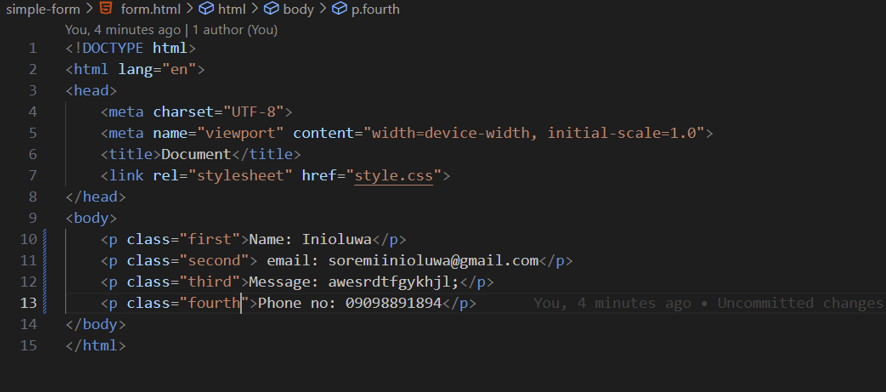

## Cloning repo

## Placing client's HTML form file (form.html) and CSS (style.css) in simple-form folder 

## Using Git to add the form.html and style.css files to the staging area

## Committing the staged files with a message:

## Pushing the initial commit to the remote repository:

## modifying form.html to include an additional field for a phone number and update the styling in style.css

## After making these changes, stage and commit the updated files with a message:

## Pushing latest changes to the remote repository:

## After working on several features and fixes, viewing the Git history to check all the changes you've made:

## finding the commit hash of the last working version using git log, 

## Then running

## Creating a new branch called feature-add-captcha and switch to it:

## Making the necessary changes for the CAPTCHA feature, then staging and committing them:

## Merging the changes back into the main branch:

## After merging, pushing the updated main branch to the remote repository:

## Accidentally made some unwanted changes to style.css that I haven’t committed yet. Discarding these local changes and revert the file to its previous state:

